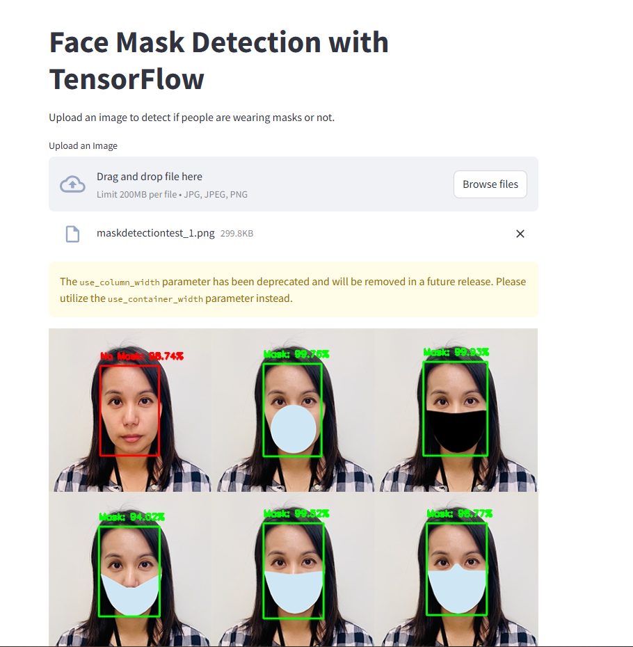

# Face Mask Detection

## Overview

The **Face Mask Detection** project utilizes deep learning techniques to identify whether individuals are wearing face masks in real-time video streams or images. This project leverages the power of **TensorFlow** and **Keras** for building and training a **Convolutional Neural Network (CNN)** using the **MobileNetV2** architecture, which is pre-trained on ImageNet for feature extraction.

The model classifies images into two categories:
- **Mask**: The individual is wearing a mask.
- **No Mask**: The individual is not wearing a mask.

## Table of Contents
1. [Installation](#installation)
2. [Usage](#usage)
   - [Training the Model](#training-the-model)
   - [Testing with Video and Image via Streamlit](#testing-with-video-and-image-via-streamlit)
3. [Outputs](#outputs)
   - [Model](#model)
4. [Dataset](#dataset)

## Installation

### Clone the Repository
Start by cloning the repository to your local machine:

```bash
git clone https://github.com/karthigamuthuraj/Deep-Learning-Mask-Detector-Using-TensorFlow.git
cd Deep-Learning-Mask-Detector-Using-TensorFlow
```

### Install Dependencies

This project requires Python 3.x and the following Python packages:

- TensorFlow
- Keras
- NumPy
- scikit-learn
- OpenCV
- imutils
- Matplotlib
- Streamlit

To install all required dependencies, you can use the provided `requirements.txt` file:

```bash
pip install -r requirements.txt
```

## Usage

### Training the Model

To train the mask detection model, you need to provide a dataset of images organized into two folders: `mask` and `no_mask`. Each folder should contain images of individuals with and without face masks.

Run the following command to begin training the model:

```bash
python train_mask_detector.py --dataset <path_to_dataset> --model mask_detector.model --plot plot.png
```

- `<path_to_dataset>`: Path to your dataset folder containing the images.
- `mask_detector.model`: The name of the model file where the trained model will be saved.

### Testing with Video and Image via Streamlit

Once the model is trained, you can use the Streamlit app to test face mask detection in images and videos.

Run the following command to launch the Streamlit app:

```bash
streamlit run app.py
```

The app will allow you to upload an image or select a video file for face mask detection. The app will process the input and display whether a mask is detected or not. It will also display the video with bounding boxes around the detected faces, showing the mask classification in real-time.

## Outputs

### Model

After training, the model is saved as `mask_detector.model`. This model can be loaded and used for prediction tasks.


## Dataset

The dataset used for training should be organized as follows:

```
dataset/
    with_mask/
        image1.jpg
        image2.jpg
        ...
    without_mask/
        image1.jpg
        image2.jpg
        ...
```

Each image should represent either a person wearing a mask (`with_mask` folder) or not wearing a mask (`without_mask` folder). It is essential that the dataset is labeled correctly to ensure accurate model training.

---




[Watch the demo video](VideoOutputTest.mp4)

[Demo App](https://huggingface.co/spaces/karthigamuthuraj/RealTimeFaceMaskDetection)


